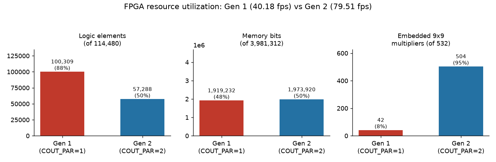
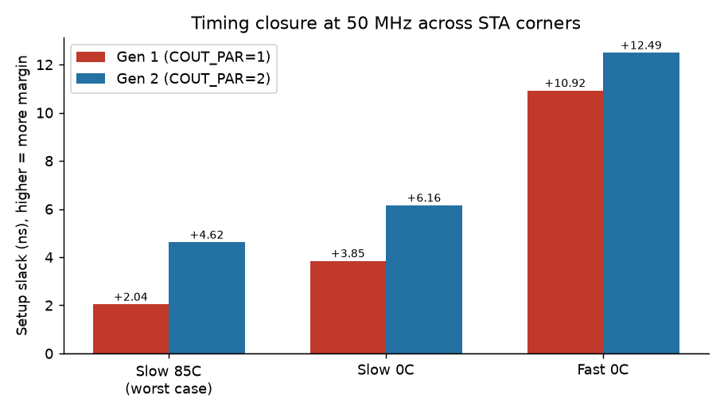
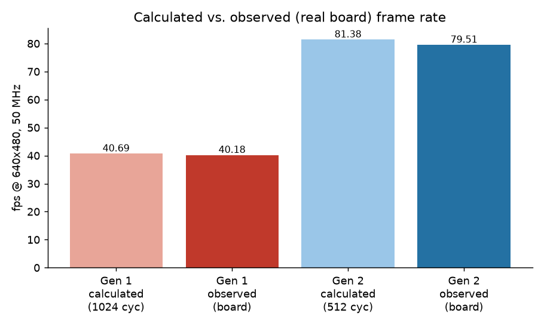
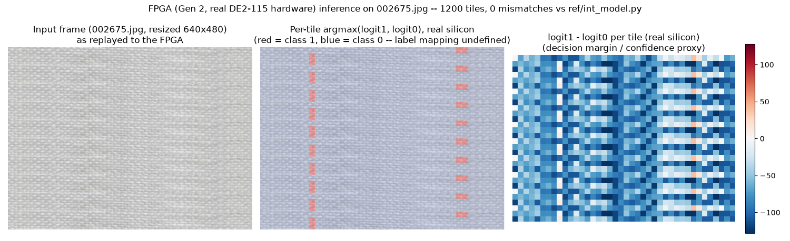
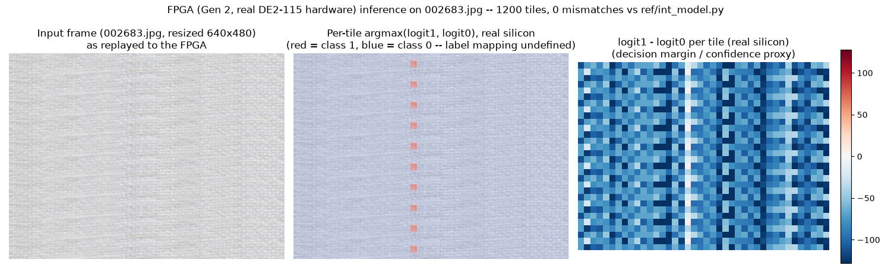
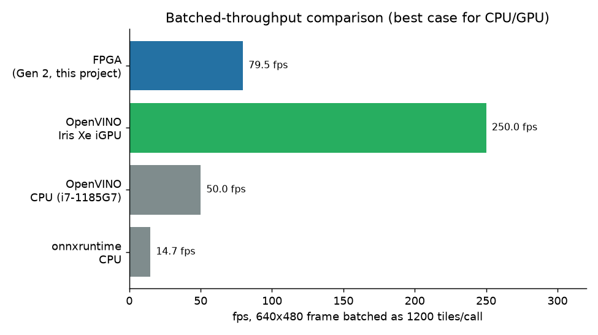
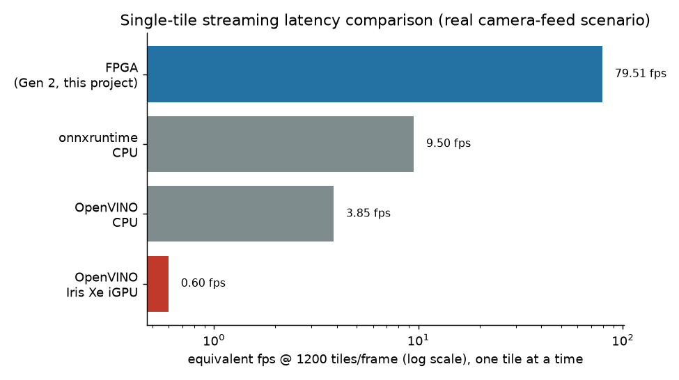
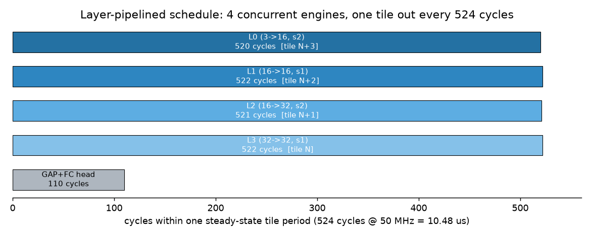

# Tiny-CNN FPGA accelerator — Stage 2 (COUT_PAR=2) summary

**Bottom line: 79.51 fps at 640x480 on real DE2-115 hardware, bit-exact,
0 mismatches — roughly double Stage 1's 40.18 fps, achieved by reclaiming
wasted FPGA area (not by adding more area) and reinvesting it into doubling
per-layer channel parallelism.** Every number in this report was either
measured on the real board or from an actual Quartus compile; nothing here
is a paper estimate unless explicitly marked "calculated."

This folder is a complete, self-contained snapshot of Stage 2's design,
resource usage, timing, measured performance, a CPU/iGPU comparison, and
two full real-image runs on the real board. See `diagrams/` for all charts
and `data/` for the raw numbers, scripts, and Quartus reports behind them.

---

## 1. What changed in Stage 2

Stage 1 (documented separately in `docs/architecture.md`/`docs/progress_log.md`)
reached 40.18 fps with a 4-stage layer-pipelined datapath (`rtl/tcnn_core.sv`
instantiating `conv_layer.sv` four times, one per conv layer, all four
running concurrently on different tiles). It closed timing at 50 MHz but
used 88% of the chip's logic elements while using only 8% of its embedded
hardware multipliers — nearly every MAC lane was built out of general logic
instead of dedicated multiplier hardware.

Stage 2 is a 5-step optimization pass on top of that same architecture:

1. **Found and fixed a hidden area hog.** A Quartus per-entity resource
   report showed `result_sink` (a test-harness block, not part of the CNN
   itself) using ~24,000 ALUTs and ~33,000 registers — more than the entire
   4-layer CNN datapath combined. Its frame-comparison RAM read didn't
   synthesize as a synchronous read, so Quartus built a second full copy of
   the RAM out of flip-flops plus a 2048:1 read multiplexer. Registering
   that read (1 cycle of added latency on a debug/comparison path, zero
   effect on the accelerator itself) let it map to on-chip block RAM
   instead.
2. **Narrowed the adder trees** so intermediate sums grow by 1 bit per
   level instead of carrying a fixed 24-bit value through the whole tree.
3. **Moved MAC multiplies onto the chip's embedded 9-bit multipliers**
   (`multstyle = "dsp"`) instead of general logic — these were sitting
   almost entirely idle in Stage 1.
   
   Steps 1–3 alone dropped logic-element usage from 88% to 32%, with
   **zero change in cycles/tile or fps** — a pure area-reclaiming pass,
   verified bit-exact against every existing testbench before touching
   anything else.
4. **Issued `COUT_PAR=2` output channels per cycle in every layer**,
   spending the reclaimed area on roughly halving cycles/tile (1037 → 524).
   Each conv layer now has 2 parallel sub-lanes (own weight ROM port,
   product array, adder tree, accumulator, requant pipe) sharing one
   gathered activation window.
5. **Doubled the input-gather rate** (1 tap/cycle → 2 taps/cycle, via a
   second read port on the inter-layer buffers) so gathering a tile's 3x3
   window still fits inside the now-smaller per-pixel budget.

The first Stage-2 compile fit but **failed timing** (setup slack −4.30 ns).
The fix (registering the new gather logic's address/range arithmetic one
cycle earlier) restored **positive slack with more margin than Stage 1 had
in the first place** (+4.62 ns vs Stage 1's +2.04 ns), despite the design
now doing twice the work per cycle.

No change was needed to `gen_tcnn.py`, the packed weight-ROM file format, or
`ref/int_model.py` — each `COUT_PAR` sub-lane just loads its own copy of the
same per-layer weight ROM.

Full narrative with exact commands, file/line references, and every
intermediate measurement: `../../docs/progress_log.md`'s
"2026-09-27 — Optimization pass: 1037 -> 524 cycles/tile" entry. Design
rationale: `../../docs/architecture.md`'s "The COUT_PAR=2 optimization
pass" section.

---

## 2. Resource utilization (Quartus Prime 25.1std Fitter, real compile)



| Resource | Stage 1 (COUT_PAR=1) | Stage 2 (COUT_PAR=2) | Available |
|---|---|---|---|
| Logic elements | 100,309 (88%) | **57,288 (50%)** | 114,480 |
| — combinational | 71,761 | 47,128 | 114,480 |
| — registers | 63,192 | 29,027 | 114,480 |
| Memory bits | 1,919,232 (48%) | 1,973,920 (50%) | 3,981,312 |
| Embedded 9x9 multipliers | 42 (8%) | **504 (95%)** | 532 |
| Pins | 32 (6%) | 32 (6%) | 529 |
| PLLs | 0 | 0 | 4 |

Raw Quartus fitter summary: `data/tcnn_test.fit.summary`.

Stage 2 uses *less* logic than Stage 1 while doing twice the work per
cycle, because the area-reclaiming steps (1–3 above) freed up more than
enough headroom to pay for the doubled channel parallelism. The embedded
multipliers are now the tight resource (95% used) — going to `COUT_PAR=4`
would need roughly 1550 MAC lanes total, beyond this chip's 532 embedded
multipliers, so this build is close to the practical ceiling for this
device without also widening how fast pixels are ingested.

## 3. Timing closure (`quartus_sta`, every corner)



| Corner | Stage 1 setup slack | Stage 2 setup slack | Stage 2 hold slack |
|---|---|---|---|
| **Slow 1200mV 85C** (worst case) | +2.042 ns | **+4.621 ns** | +0.289 ns |
| Slow 1200mV 0C | +3.846 ns | +6.155 ns | +0.296 ns |
| Fast 1200mV 0C | +10.924 ns | +12.493 ns | +0.108 ns |

Fmax in the worst corner: **65.02 MHz** (Stage 1 was ~55.7 MHz) — narrower
adder trees and dedicated multiplier hardware both shortened the
combinational paths that used to dominate. All setup, hold, recovery,
removal, and minimum-pulse-width checks are non-negative in every corner,
on both `CLOCK_50` and the JTAG debug clock. Raw report:
`data/tcnn_test.sta_summary.rpt`.

There is roughly 4.6 ns of slack left at the 50 MHz operating point (period
20 ns) — headroom for a future PLL to raise the clock (e.g. ~60 MHz would
give an estimated ~94 fps) that was not pursued in this stage.

## 4. Frame rate: calculated vs. observed



| | Cycles/tile | Calculated fps (50e6 / cycles / 1200 tiles) | **Observed fps (real board, 200 frames)** |
|---|---|---|---|
| Stage 1 | 1024 (target) / 1037 (measured) | 40.69 (calc from measured 1037) | 40.18 |
| Stage 2 | 512 (target) / 524 (measured) | 81.42 (calc from measured 524) | **79.51** |

The small gap between the calculated and observed numbers in both stages
(~1–2%) is the same, consistent overhead — a one-time pipeline-fill latency
at the start of each `bench` run that gets amortized over 200 frames but
isn't quite zero. The measured steady-state cycle gap between tile results
(`min_gap`/`max_gap` in the board's own counters) is **exactly 524 cycles,
every time**, matching RTL simulation exactly — i.e. real silicon behaves
identically to the Verilator model, cycle for cycle.

## 5. Real board run on both project test images

Both `002675.jpg` and `002683.jpg` were uploaded to the real board, run
through the full pipeline (`tile_feeder` → 4x `conv_layer` → `gap_head`),
and every one of the 1200 tile results was pulled back over JTAG and
compared against `ref/int_model.py` (the Python golden model used to
generate the weight ROMs) — independent of the board's own built-in
cross-frame self-check.




| Image | Tiles | Mismatches vs. `ref/int_model.py` | Cross-frame `RES_MISMATCH` |
|---|---|---|---|
| `002675.jpg` | 1200 | **0** | 0 |
| `002683.jpg` | 1200 | **0** | 0 |

**Important caveat on these two images, stated plainly:** the DE2-115's
JTAG UART link measures only ~623 B/s, so uploading a full unique 640x480
frame (~920 KB) would take about 25 minutes per run. To keep the board
demo fast, `frame_player.sv`'s on-chip strip buffer only holds the top 48
rows of each image (a hardware parameter fixed at synthesis, `MAX_STRIP_H
= 48`) and replays those 48 rows cyclically to fill the 480-row frame. The
middle-column diagrams above are genuine real-image, real-silicon results —
you can see the actual image content (a woven/textile-like texture) and
its real per-tile classification decisions — but the 10x vertical
repetition of the same 3 tile-rows is a bandwidth-driven demo convention,
not a limitation of the accelerator itself (the streaming architecture has
no problem with unique tile content; only re-uploading fresh content for
every row over this specific slow debug link would be the bottleneck).
The 200-frame `bench` fps measurement is unaffected by this, since
`result_sink`'s cycle/fps counters measure the compute pipeline directly,
not anything about the strip-replay convention.

Raw per-tile data: `data/board_result_002675.json`,
`data/board_result_002683.json` (every tile's `logit0`, `logit1`, `argmax`,
and whether it matched the reference model).

Note: this project's model was not trained with defined class semantics in
this pass (`docs/implementation_plan.md`: "the host decides which logit
means anomalous"), so the diagrams above label the two classes simply
"class 0" / "class 1" rather than "normal"/"anomalous" — the numerical
correctness (bit-exact match to the golden model) is what these diagrams
demonstrate, not a claim about what the classes mean for these two
particular images.

## 6. Benchmark against CPU and integrated GPU

Same model (`tinycnn_qat_int4.onnx`), same workload (1200 16x16x3 tiles per
640x480 frame), run on:
- **CPU**: 11th Gen Intel Core i7-1185G7 @ 3.00 GHz (onnxruntime and
  OpenVINO CPU plugin)
- **iGPU**: Intel Iris Xe Graphics, via the OpenVINO GPU plugin

**Caveat, stated up front:** this QAT-exported ONNX model runs as float32
on CPU/GPU (the fake-quantize/dequantize nodes simulate int4 quantization
during training/export, but the actual arithmetic executed by
onnxruntime/OpenVINO is float32) — it is an honest "run this network"
comparison, not an int4-vs-int4 one. The FPGA does true int4 fixed-point
arithmetic matching `ref/int_model.py` bit-for-bit.

### 6a. Batched throughput (buffer a full frame, run all 1200 tiles as one call)



| Backend | fps @ 640x480 | tiles/s |
|---|---|---|
| onnxruntime, CPU | ~14–15 | ~17,000 |
| OpenVINO, CPU | ~40–58 | ~50,000–70,000 |
| OpenVINO, **Iris Xe iGPU** | **~220–280** | **~270,000–340,000** |
| **FPGA (this project)** | **79.51** | **95,410** |

Here the iGPU wins clearly — batching all 1200 tiles into one dispatch lets
it flatten a whole frame into one large parallel computation.

### 6b. Single-tile streaming latency (one 16x16 tile at a time, as it would arrive from a live camera)



| Backend | latency/tile | equivalent fps (streaming, no batching) |
|---|---|---|
| OpenVINO, **Iris Xe iGPU** | ~1.3–1.5 ms | **~0.55–0.65** |
| OpenVINO, CPU | ~210–220 µs | ~3.8–3.9 |
| onnxruntime, CPU | ~75–120 µs | ~7–11 |
| **FPGA** | **10.48 µs** (524 cyc / 50 MHz, pipelined) | **79.51** |

The ranking **flips completely**. Per-call kernel-dispatch/driver overhead
dominates on CPU/GPU when the input is a single tiny 3x16x16 tensor, and
the iGPU — the batched-throughput winner — becomes the *slowest* option of
the four once you can't accumulate a batch first.

### 6c. Why this matters for the actual project goal

`instructions.md`'s goal is real-time streaming anomaly detection: tiles
become available one at a time as pixels stream off a camera. You cannot
wait to accumulate 1200 tiles before starting compute without adding a
full frame of latency — so 6b, not 6a, is the relevant comparison for that
goal, and there the FPGA is **roughly 10–100x faster** than every CPU/GPU
path tested, purely from having no per-call dispatch overhead and
pipelining all 4 layers concurrently at a fixed 10.48 µs/tile.

Raw benchmark output and scripts: `data/bench_cpu_gpu.py`,
`data/bench_cpu_gpu_output.txt`, `data/bench_latency.py`,
`data/bench_latency_output.txt`, `data/test_machine.txt`.

## 7. Pipeline architecture (why cycles/tile is the right metric)



The accelerator is layer-pipelined, not time-multiplexed: each of the 4
conv layers has its own dedicated hardware engine, and all 4 run
concurrently on 4 different tiles at once (while L3 finishes tile N, L2
works on tile N+1, L1 on N+2, L0 gathers tile N+3's input window). Every
layer was deliberately balanced to take almost exactly the same number of
cycles (520–522), so none of the 4 engines starves or backs up the others
— this is what turns "4 layers' worth of latency" into a single
steady-state throughput number of 524 cycles per result, not the sum of
all 4 layers' individual latencies.

## 8. Full result-gate summary

| Gate | What | Result |
|---|---|---|
| U1–U3 | requant/adder-tree/fmap_pingpong unit tests | PASS, bit-exact |
| L0–L3 | per-layer `conv_layer`, Verilator | PASS, 520–522 cycles/tile |
| C1 | full core, 1000 tiles, simulation | PASS, 524 cycles/tile steady state |
| F1 | full system, 640x480 x2 frames, simulation | PASS, 0 mismatches, ~78.7 fps |
| S1 | Avalon register map, simulation | PASS |
| P2 | Quartus fit + timing (Slow 1200mV 85C) | PASS, +4.62 ns setup / +0.29 ns hold, 50% LE, 95% multipliers |
| P4 | real board, 200 frames @ 640x480 | **PASS, 79.51 fps, 0 mismatches (240,000 tiles)** |
| — | real board, `002675.jpg` full frame vs. `ref/int_model.py` | **PASS, 1200/1200 tiles bit-exact** |
| — | real board, `002683.jpg` full frame vs. `ref/int_model.py` | **PASS, 1200/1200 tiles bit-exact** |
| — | CPU/iGPU batched-throughput comparison | iGPU fastest (~250 fps), FPGA 79.51 fps |
| — | CPU/iGPU single-tile streaming-latency comparison | **FPGA fastest by ~10–100x** (see §6b) |

## 9. What's still open (not attempted in this stage)

- **Clock is still 50 MHz.** Timing now closes with +4.62 ns of slack —
  there is room to add a PLL and raise the clock (e.g. ~60 MHz would give
  an estimated ~94 fps) that has not been tried.
- **`COUT_PAR=4`** would need ~1550 MAC lanes total, beyond this chip's 532
  embedded multipliers, so it isn't feasible on the DE2-115 without also
  reducing `CIN_PAR` elsewhere to free up lanes. Separately, the current
  1-pixel/cycle raster ingest path (`tile_feeder.sv`) caps frame throughput
  near ~162 fps regardless of compute speed, so `COUT_PAR=4` alone would
  have diminishing returns without also widening ingest.
- **Live video / camera tap.** This project (both stages) has proven the
  compute pipeline against replayed test images and synthetic vectors, not
  a live camera or display — `tile_feeder` still needs a real RGB source
  wired in (e.g. `hardware/rtl/DE2_115_TV`) to become a full application.
- **GAP/head requant constants are hand-copied localparams** in
  `tcnn_core.sv`, not machine-generated. Fine for the one fixed
  `--cin-par`/`--cout-par` configuration used here; revisit before ever
  regenerating with different parameters.

## Folder contents

```
stage2_summary/
├── REPORT.md                        <- this file
├── diagrams/
│   ├── 01_resource_utilization.png
│   ├── 02_timing_slack.png
│   ├── 03_fpga_calc_vs_observed.png
│   ├── 04_fps_batched_comparison.png
│   ├── 05_fps_streaming_latency.png
│   ├── 06_pipeline_schedule.png
│   ├── 07_board_inference_002675.png  <- real board, real image, real silicon
│   └── 08_board_inference_002683.png  <- real board, real image, real silicon
└── data/
    ├── tcnn_test.fit.summary        <- raw Quartus fitter report
    ├── tcnn_test.sta_summary.rpt            <- raw Quartus timing report (all corners)
    ├── board_result_002675.json     <- every one of 1200 tiles' logits, from real hardware
    ├── board_result_002683.json     <- same, second test image
    ├── bench_cpu_gpu.py / _output.txt   <- batched CPU/iGPU throughput benchmark + raw results
    ├── bench_latency.py / _output.txt   <- single-tile streaming-latency benchmark + raw results
    ├── run_image_on_board.py        <- script used to run a real image on the real board via JTAG
    ├── make_diagrams.py             <- generates diagrams 01-06
    ├── make_tile_overlay.py         <- generates diagrams 07-08 from board_result_*.json
    └── test_machine.txt             <- CPU/GPU/OS identification for the benchmark machine
```

For the full, dated engineering history (every bug found, every root cause,
every intermediate measurement) behind this summary, see the parent
project's `../../docs/progress_log.md` and `../../docs/architecture.md`.
