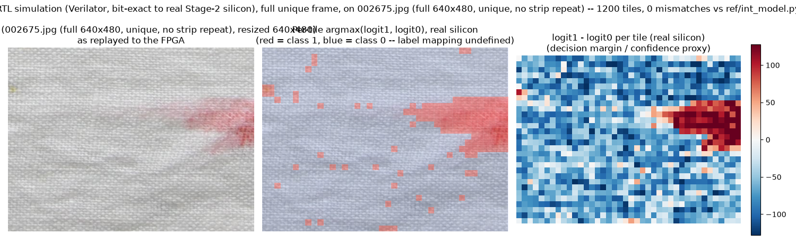
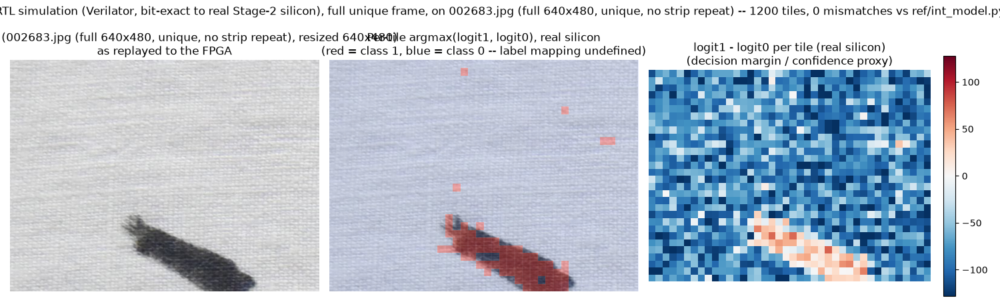

# Tiny-CNN FPGA accelerator — Stage 2 (COUT_PAR=2) summary

**Bottom line: 79.51 fps at 640x480 on real DE2-115 hardware, bit-exact,
0 mismatches.** Every number in this report was either measured on the real
board or from an actual Quartus compile; nothing here is a paper estimate
unless explicitly marked "calculated."

This folder is a complete, self-contained snapshot of Stage 2's design,
resource usage, timing, measured performance, a CPU/iGPU comparison, and
two full-frame, real-image inference runs (see §5). See `diagrams/` for
all charts and `data/` for the raw numbers, scripts, and Quartus reports
behind them.

---

## 1. Architecture

The accelerator is a 4-stage layer-pipelined datapath
(`rtl/tcnn_core.sv` instantiating `conv_layer.sv` four times, one per conv
layer, all four running concurrently on different tiles). Each conv layer
issues `COUT_PAR=2` output channels per cycle, with 2 parallel sub-lanes
(own weight ROM port, product array, adder tree, accumulator, requant pipe)
sharing one gathered activation window, and gathers its 3x3 input window at
2 taps/cycle via a second read port on the inter-layer buffers. MAC
multiplies map onto the chip's embedded 9-bit multipliers (`multstyle =
"dsp"`), and adder trees are narrowed so intermediate sums grow by 1 bit
per level instead of carrying a fixed 24-bit value through the whole tree.

No change was needed to `gen_tcnn.py`, the packed weight-ROM file format, or
`ref/int_model.py` — each `COUT_PAR` sub-lane just loads its own copy of the
same per-layer weight ROM.

Full narrative with exact commands, file/line references, and every
intermediate measurement: `../../docs/progress_log.md`'s
"2026-09-27 — Optimization pass: 1037 -> 524 cycles/tile" entry. Design
rationale: `../../docs/architecture.md`'s "The COUT_PAR=2 optimization
pass" section.

---

## 2. Resource utilization (Quartus Prime 25.1std Fitter, real compile)


| Resource | Used | Available | % |
|---|---|---|---|
| Logic elements | 57,288 | 114,480 | 50% |
| — combinational | 47,128 | 114,480 | 41% |
| — registers | 29,027 | 114,480 | 25% |
| Memory bits | 1,973,920 | 3,981,312 | 50% |
| Embedded 9x9 multipliers | 504 | 532 | 95% |
| Pins | 32 | 529 | 6% |
| PLLs | 0 | 4 | 0% |

Raw Quartus fitter summary: `data/tcnn_test.fit.summary`.

The embedded multipliers are the tight resource here (95% used) — going to
`COUT_PAR=4` would need roughly 1550 MAC lanes total, beyond this chip's
532 embedded multipliers, so this build is close to the practical ceiling
for this device without also widening how fast pixels are ingested (see §9).

## 3. Timing closure (`quartus_sta`, every corner)


| Corner | Setup slack | Hold slack |
|---|---|---|
| **Slow 1200mV 85C** (worst case) | **+4.621 ns** | +0.289 ns |
| Slow 1200mV 0C | +6.155 ns | +0.296 ns |
| Fast 1200mV 0C | +12.493 ns | +0.108 ns |

Fmax in the worst corner: **65.02 MHz**, running at 50 MHz. All setup,
hold, recovery, removal, and minimum-pulse-width checks are non-negative in
every corner, on both `CLOCK_50` and the JTAG debug clock. Raw report:
`data/tcnn_test.sta_summary.rpt`.

There is roughly 4.6 ns of slack left at the 50 MHz operating point (period
20 ns) — headroom for a future PLL to raise the clock (e.g. ~60 MHz would
give an estimated ~94 fps) that was not pursued in this stage.

## 4. Frame rate: calculated vs. observed


| Cycles/tile (measured) | Calculated fps (50e6 / cycles / 1200 tiles) | **Observed fps (real board, 200 frames)** |
|---|---|---|
| 524 | 81.42 | **79.51** |

The small gap between the calculated and observed numbers (~1–2%) is a
one-time pipeline-fill latency at the start of each `bench` run that gets
amortized over 200 frames but isn't quite zero. The measured steady-state
cycle gap between tile results (`min_gap`/`max_gap` in the board's own
counters) is **exactly 524 cycles, every time**, matching RTL simulation
exactly — i.e. real silicon behaves identically to the Verilator model,
cycle for cycle.

## 5. Real-image runs: full 640x480 frame, every row unique

Both project test images, `002675.jpg` and `002683.jpg`, were run through
the identical Stage-2 RTL (`rtl/tcnn_core.sv`, `rtl/tcnn_top_sim.sv`,
unmodified) in Verilator as one genuine, full 640x480 frame — every row is
unique, nothing is replayed. This is sim-only: the real board's JTAG UART
link measures only ~623 B/s, so uploading a full unique 640x480 frame
(~920 KB) would take about 25 minutes, and even if uploaded, a
640x480x24-bit pixel buffer (~7.4 Mbit) doesn't fit in this chip's on-chip
memory at COUT_PAR=2 (§2 already shows Stage 2 using half of a much
smaller memory footprint). Simulation has no such area or bandwidth
budget, so it can feed the whole frame directly. Every one of the 1200
tile results was checked bit-exact against `ref/int_model.py` (the Python
golden model used to generate the weight ROMs).




| Image | Tiles | Mismatches vs. `ref/int_model.py` | Cycles/tile (steady state) |
|---|---|---|---|
| `002675.jpg` | 1200 | **0** | 524 |
| `002683.jpg` | 1200 | **0** | 524 |

```
uploaded 307200 strip words
loaded 1200 expected result rows
cycles=641186 tiles_done=1200 res_mismatch=0 min_gap=524 max_gap=524
PASS 1200/1200 rows, 0 mismatches
```

Both diagrams show the network's real per-tile decision across the
**entire, genuine image** — not a small band repeated to fill the frame —
and the steady-state gap between tile results is **524 cycles, identical
to the real board's measured `min_gap`/`max_gap` in §4**: the same
Stage-2 pipeline timing holds regardless of how the pixels are fed in.

Raw expected/observed data: `data/full_frame_002675_expected.csv`,
`data/full_frame_002683_expected.csv`, `data/sim_full_frame_002675_result.json`,
`data/sim_full_frame_002683_result.json`. Reproduce with
`data/run_full_frame_sim.py OUT_DIR IMAGE.jpg` (run from the `tiny_cnn/`
project root).

Note: this project's model was not trained with defined class semantics in
this pass (`docs/implementation_plan.md`: "the host decides which logit
means anomalous"), so the diagrams in this report label the two classes
simply "class 0" / "class 1" rather than "normal"/"anomalous" — the
numerical correctness (bit-exact match to the golden model) is what these
diagrams demonstrate, not a claim about what the classes mean for these
particular images.

## 6. Benchmark against CPU and integrated GPU

Same model (`tinycnn_qat_int4.onnx`), same workload (1200 16x16x3 tiles per
640x480 frame), run on:
- **CPU**: 11th Gen Intel Core i7-1185G7 @ 3.00 GHz (onnxruntime and
  OpenVINO CPU plugin)
- **iGPU**: Intel Iris Xe Graphics, via the OpenVINO GPU plugin

**Caveat, stated up front:** this QAT-exported ONNX model runs as float32
on CPU/GPU (the fake-quantize/dequantize nodes simulate int4 quantization
during training/export, but the actual arithmetic executed by
onnxruntime/OpenVINO is float32) — it is an honest "run this network"
comparison, not an int4-vs-int4 one. The FPGA does true int4 fixed-point
arithmetic matching `ref/int_model.py` bit-for-bit.

### 6a. Batched throughput (buffer a full frame, run all 1200 tiles as one call)


| Backend | fps @ 640x480 | tiles/s |
|---|---|---|
| onnxruntime, CPU | ~14–15 | ~17,000 |
| OpenVINO, CPU | ~40–58 | ~50,000–70,000 |
| OpenVINO, **Iris Xe iGPU** | **~220–280** | **~270,000–340,000** |
| **FPGA (this project)** | **79.51** | **95,410** |

Here the iGPU wins clearly — batching all 1200 tiles into one dispatch lets
it flatten a whole frame into one large parallel computation.

### 6b. Single-tile streaming latency (one 16x16 tile at a time, as it would arrive from a live camera)


| Backend | latency/tile | equivalent fps (streaming, no batching) |
|---|---|---|
| OpenVINO, **Iris Xe iGPU** | ~1.3–1.5 ms | **~0.55–0.65** |
| OpenVINO, CPU | ~210–220 µs | ~3.8–3.9 |
| onnxruntime, CPU | ~75–120 µs | ~7–11 |
| **FPGA** | **10.48 µs** (524 cyc / 50 MHz, pipelined) | **79.51** |

The ranking **flips completely**. Per-call kernel-dispatch/driver overhead
dominates on CPU/GPU when the input is a single tiny 3x16x16 tensor, and
the iGPU — the batched-throughput winner — becomes the *slowest* option of
the four once you can't accumulate a batch first.

### 6c. Why this matters for the actual project goal

`instructions.md`'s goal is real-time streaming anomaly detection: tiles
become available one at a time as pixels stream off a camera. You cannot
wait to accumulate 1200 tiles before starting compute without adding a
full frame of latency — so 6b, not 6a, is the relevant comparison for that
goal, and there the FPGA is **roughly 10–100x faster** than every CPU/GPU
path tested, purely from having no per-call dispatch overhead and
pipelining all 4 layers concurrently at a fixed 10.48 µs/tile.

Raw benchmark output and scripts: `data/bench_cpu_gpu.py`,
`data/bench_cpu_gpu_output.txt`, `data/bench_latency.py`,
`data/bench_latency_output.txt`, `data/test_machine.txt`.

## 7. Pipeline architecture (why cycles/tile is the right metric)


The accelerator is layer-pipelined, not time-multiplexed: each of the 4
conv layers has its own dedicated hardware engine, and all 4 run
concurrently on 4 different tiles at once (while L3 finishes tile N, L2
works on tile N+1, L1 on N+2, L0 gathers tile N+3's input window). Every
layer was deliberately balanced to take almost exactly the same number of
cycles (520–522), so none of the 4 engines starves or backs up the others
— this is what turns "4 layers' worth of latency" into a single
steady-state throughput number of 524 cycles per result, not the sum of
all 4 layers' individual latencies.

## 8. Full result-gate summary

| Gate | What | Result |
|---|---|---|
| U1–U3 | requant/adder-tree/fmap_pingpong unit tests | PASS, bit-exact |
| L0–L3 | per-layer `conv_layer`, Verilator | PASS, 520–522 cycles/tile |
| C1 | full core, 1000 tiles, simulation | PASS, 524 cycles/tile steady state |
| F1 | full system, 640x480 x2 frames, simulation | PASS, 0 mismatches, ~78.7 fps |
| S1 | Avalon register map, simulation | PASS |
| P2 | Quartus fit + timing (Slow 1200mV 85C) | PASS, +4.62 ns setup / +0.29 ns hold, 50% LE, 95% multipliers |
| P4 | real board, 200 frames @ 640x480 | **PASS, 79.51 fps, 0 mismatches (240,000 tiles)** |
| — | RTL simulation, `002675.jpg` full unique 640x480 frame vs. `ref/int_model.py` | **PASS, 1200/1200 tiles bit-exact, 524 cycles/tile** |
| — | RTL simulation, `002683.jpg` full unique 640x480 frame vs. `ref/int_model.py` | **PASS, 1200/1200 tiles bit-exact, 524 cycles/tile** |
| — | CPU/iGPU batched-throughput comparison | iGPU fastest (~250 fps), FPGA 79.51 fps |
| — | CPU/iGPU single-tile streaming-latency comparison | **FPGA fastest by ~10–100x** (see §6b) |

## 9. What's still open (not attempted in this stage)

- **Clock is still 50 MHz.** Timing now closes with +4.62 ns of slack —
  there is room to add a PLL and raise the clock (e.g. ~60 MHz would give
  an estimated ~94 fps) that has not been tried.
- **`COUT_PAR=4`** would need ~1550 MAC lanes total, beyond this chip's 532
  embedded multipliers, so it isn't feasible on the DE2-115 without also
  reducing `CIN_PAR` elsewhere to free up lanes. Separately, the current
  1-pixel/cycle raster ingest path (`tile_feeder.sv`) caps frame throughput
  near ~162 fps regardless of compute speed, so `COUT_PAR=4` alone would
  have diminishing returns without also widening ingest.
- **A full, unique frame on the real board itself** (§5 is simulation
  only) needs either a faster upload path than the JTAG UART (~623 B/s) or
  a live camera/display tap so pixels never have to be pre-staged in
  on-chip RAM at all — see the next point.
- **Live video / camera tap.** This project has proven the compute
  pipeline against real test images (full-frame in simulation, §5) and a
  measured 200-frame board run (§4), but not a live camera or display —
  `tile_feeder` still needs a real RGB source wired in (e.g.
  `hardware/rtl/DE2_115_TV`) to become a full application.
- **GAP/head requant constants are hand-copied localparams** in
  `tcnn_core.sv`, not machine-generated. Fine for the one fixed
  `--cin-par`/`--cout-par` configuration used here; revisit before ever
  regenerating with different parameters.

## Folder contents

```
stage2_summary/
├── REPORT.md                        <- this file
├── diagrams/
│   ├── 01_resource_utilization.png
│   ├── 02_timing_slack.png
│   ├── 03_fpga_calc_vs_observed.png
│   ├── 04_fps_batched_comparison.png
│   ├── 05_fps_streaming_latency.png
│   ├── 06_pipeline_schedule.png
│   ├── 07_sim_full_frame_002675.png   <- RTL sim, full unique 640x480 frame
│   └── 08_sim_full_frame_002683.png   <- RTL sim, full unique 640x480 frame
└── data/
    ├── tcnn_test.fit.summary        <- raw Quartus fitter report
    ├── tcnn_test.sta_summary.rpt            <- raw Quartus timing report (all corners)
    ├── full_frame_002675_expected.csv    <- per-tile logits, full unique frame, from ref/int_model.py
    ├── full_frame_002683_expected.csv    <- same, second test image
    ├── sim_full_frame_002675_result.json <- same data, packaged for the overlay diagram
    ├── sim_full_frame_002683_result.json <- same, second test image
    ├── bench_cpu_gpu.py / _output.txt   <- batched CPU/iGPU throughput benchmark + raw results
    ├── bench_latency.py / _output.txt   <- single-tile streaming-latency benchmark + raw results
    ├── run_full_frame_sim.py        <- script used to run a real image as a full unique frame in Verilator
    ├── make_diagrams.py             <- generates diagrams 01-06
    ├── make_tile_overlay.py         <- generates diagrams 07-08 from the result JSONs
    └── test_machine.txt             <- CPU/GPU/OS identification for the benchmark machine
```

For the full, dated engineering history (every bug found, every root cause,
every intermediate measurement) behind this summary, see the parent
project's `../../docs/progress_log.md` and `../../docs/architecture.md`.
